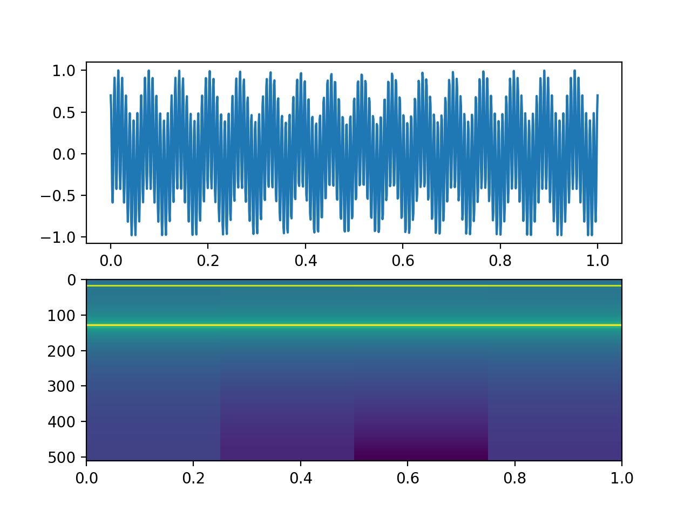

課題2-2 ヒント
=========================================

課題2-2 のスペクトルグラムのヒントです．
``sample.py`` を見てください．

* 7行目で，仮定として，[0,1] 秒の区間で定義されたデータで，これを 1024 分割しています．
* すると，サンプリング間隔 ``delta`` は，1.0/1024 になります．
* 12行目で適当な波形を ``x`` に作っています．16Hz と 128Hz の波を重ね合わせています．
* 14〜21行目で，時間帯を４区間に分割し，各区間で ``fft`` を実行します．
* 23行目以降は，プロットになります．

